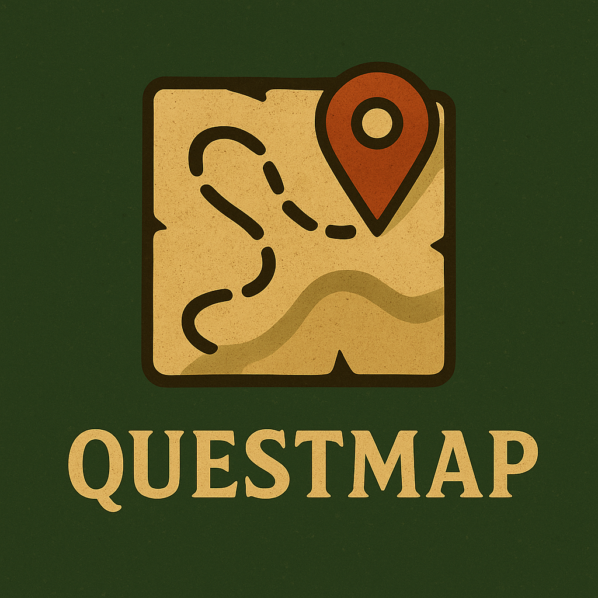

# 🌍 QuestMap: Turning Every Step into a Story

> “Every journey begins with a single step — and some steps take you to new worlds.”

---

## ⚔️ What is QuestMap?

**QuestMap** transforms your daily walks into epic adventures across fantasy worlds. Instead of just tracking steps, you'll journey through **the Sword Coast**, **Middle-earth**, and **Narnia** — walking where legends once tread.

The concept is simple:

> *What if your daily walk could feel like a quest?*

Not a grind. Not a leaderboard race.
A **journey** — one that rewards consistency, curiosity, and imagination.

## 🧭 Why Choose QuestMap?

Unlike fitness apps that focus on performance metrics, QuestMap focuses on *purpose* and storytelling.
Every walk becomes part of your personal saga — unfolding across the maps and myths that sparked your imagination.

* **Walk for your health. Travel for your soul.**
* **See your movement as a journey, not a metric.**
* **Turn daily steps into living stories.**

QuestMap reimagines the act of moving through the world — reminding us that adventure begins the moment we step outside.

## 🌠 Start Your Adventure

Whether you're walking to Mordor, Waterdeep, or just around the block — every step counts.
Every road holds meaning.
Every adventurer has a story worth telling.

**Ready to begin?** Lace up your boots, open the map, and walk your story.

---

*QuestMap — A world of a thousand stories, and one of them is yours.* 🧝‍♂️
